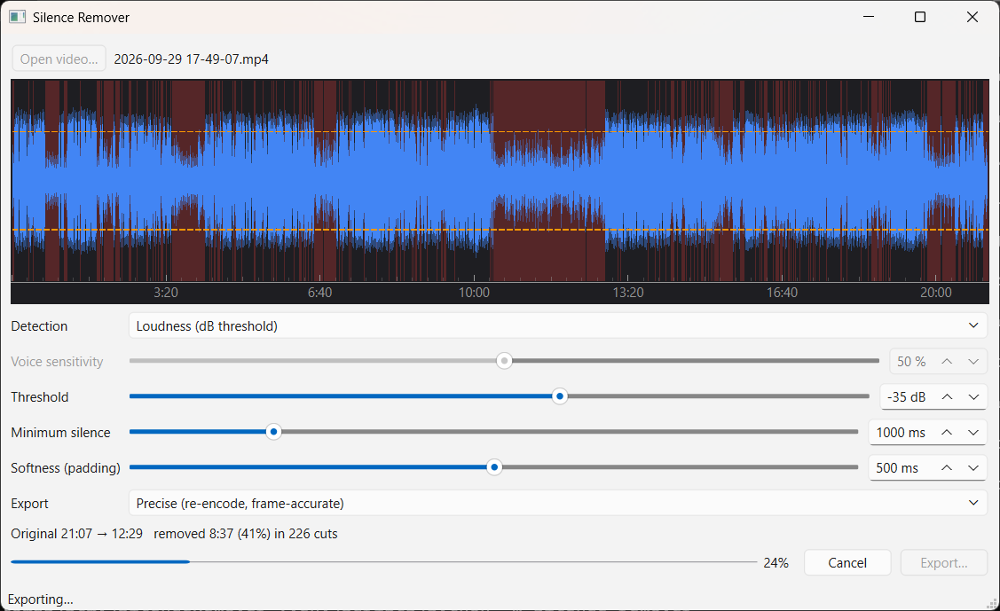
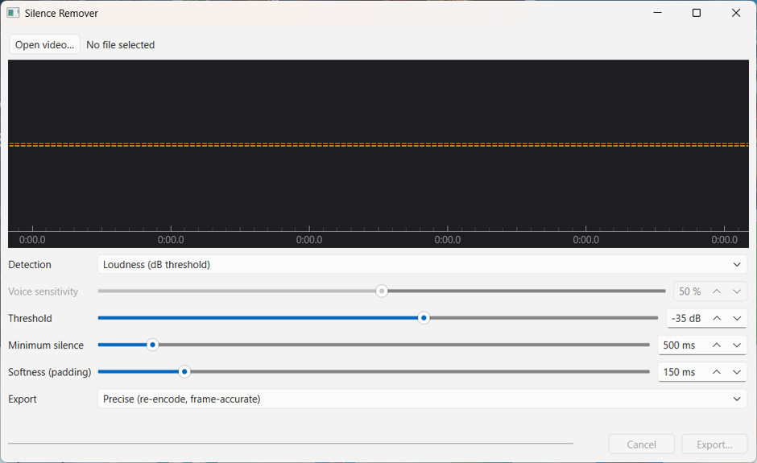

# Silence Remover

[](https://github.com/ifahimkhan/Video-Editor/actions/workflows/ci.yml)

Automatically cut silent parts out of videos and audio recordings. Similar to
Filmora's *Silence Detection*, with a live waveform preview, neural voice
detection, and a fast lossless export.

- **Two detection modes:** a classic loudness threshold, or **Silero VAD** voice
  detection, which also removes loud non-speech noise such as hum, music, fans
  and keyboard clicks.
- **Filmora-style controls:** threshold, minimum silence length and
  softness/padding.
- **Instant preview:** the audio is analyzed once, so every slider change updates
  the timeline immediately.
- **Interactive waveform:** drag the threshold line, zoom and pan, and see the
  red cut regions update live.
- **Two export modes:** *Precise* (frame-accurate re-encode) or *Fast lossless*
  (stream copy, no quality loss, done in seconds).
- **Swap audio:** replace a video's soundtrack with a cleaned-up recording; the
  picture is copied untouched.
- **Audio extractor:** save any video's full soundtrack as an MP3 in one click.
- **GUI and CLI:** the same engine works from the command line for scripting and
  batch jobs.



*A 21-minute recording with 226 silent parts (red) being removed; 41% of the
length is cut.*

---

## Quick start

### 1. Install FFmpeg (7 or newer)

FFmpeg does all decoding and encoding, and `ffmpeg` and `ffprobe` must be on
your `PATH`.

```bash
ffmpeg -version     # should print "ffmpeg version 7.x" or newer
```

On Windows, `winget install Gyan.FFmpeg` works, as do the builds from
<https://www.gyan.dev/ffmpeg/builds/>.

### 2. Install the Python dependencies (Python 3.10+)

```bash
python -m venv .venv
.venv\Scripts\activate          # Windows
# source .venv/bin/activate     # macOS / Linux
pip install -r requirements.txt
```

| Package | Needed for |
|---|---|
| `numpy` | audio analysis (required) |
| `PyQt6` | the desktop GUI |
| `pyqtgraph` | the interactive waveform (without it, the GUI uses a simpler static timeline) |
| `onnxruntime` | Voice (Silero VAD) mode (without it, only Loudness mode is available) |
| `pytest`, `pytest-cov` | running the tests |

### 3. Run it

```bash
python -m silence_remover                       # desktop app
python -m silence_remover talk.mp4 talk_cut.mp4 # command line, default settings
```

---

## Using the desktop app



1. **Open video…** Pick a video or audio file (mp4, mkv, mov, avi, webm, m4v,
   mp3, wav or m4a). The app analyzes it once; a one-hour file takes a few
   seconds.
2. **Tune the controls.** The waveform shows what will be kept and what will be
   cut, shaded red. The line below the timeline sums it up, e.g.
   `Original 12:04 → 9:31   removed 2:33 (21%) in 87 cuts`.
3. **Pick an export mode** and click **Export…**. A progress bar shows the
   export, and **Cancel** stops it at any time.

**Swap audio…** replaces the video's soundtrack with another audio file, for
example a version cleaned up in a noise-removal tool. Pick the clean audio
(wav, mp3, m4a, aac, flac, ogg or opus), then where to save.
- The video stream is copied untouched (bit-identical, no quality loss); only
  the new audio is encoded (AAC 192 kbps, or Opus for `.webm`).
- The result always has the video's length. Shorter audio is padded with
  silence and longer audio is trimmed, with a warning when the two differ by
  more than half a second.
- No silence is removed. To also cut pauses, open the swapped video and export
  it as usual.
**Export audio (MP3)…** saves the video's complete original audio track as an
MP3 (192 kbps, with title/artist tags copied). It works independently of the
silence settings: nothing is cut. The button becomes available once a file has
been analyzed.

### Controls

| Control | What it does | Tips |
|---|---|---|
| **Detection** | *Loudness* cuts anything quieter than the threshold. *Voice* keeps only what Silero VAD recognizes as speech. | Use Voice when there's background noise or music. |
| **Threshold** (dB) | Loudness mode: audio quieter than this counts as silence. Range −70 to −10, default −35. | Quiet room: −40 to −35. Noisy room: −30 to −25. |
| **Voice sensitivity** (%) | Voice mode: how confident the model must be that audio is speech. Range 5–95, default 50. | Lower keeps more (soft or whispered speech); higher cuts more aggressively. |
| **Minimum silence** (ms) | Only pauses at least this long are cut. Range 50–5000, default 500. | 300–500 for tight edits; 800+ to keep a natural pace. |
| **Softness / padding** (ms) | Audio kept before and after each stretch of speech so words aren't clipped. Range 0–1000, default 150. | Raise it if word beginnings or endings sound chopped. |
| **Export** | *Precise* or *Fast lossless*; see [Export modes](#export-modes). | |

### Waveform timeline

- **Light blue** shows the peak level. **Dark blue** shows the RMS loudness,
  which is what the threshold is compared against. The waveform uses a dB
  scale, so quiet passages stay visible.
- **Red shading** marks the parts that will be removed.
- **Orange dashed line:** the threshold. **Drag it** and the slider follows.
- **Yellow lane** (Voice mode only): speech probability over time, with its own
  draggable sensitivity line.
- **Mouse wheel** zooms the time axis and **dragging** pans it.

---

## Detection modes

| | Loudness | Voice (Silero VAD) |
|---|---|---|
| Decides by | RMS level in dBFS | Neural speech probability |
| Background hum, music, fans | Kept if louder than the threshold | Removed |
| Very quiet or whispered speech | Cut if below the threshold | Usually kept |
| Extra analysis time | none | about 2 s per 15 min of audio |

Voice mode uses the bundled model `silence_remover/models/silero_vad_v6.onnx`.
To use a different copy, point the `SILENCE_REMOVER_VAD_MODEL` environment
variable at it. Only this exact Silero v6 export (the one shipped with
faster-whisper) is supported.

---

## Export modes

| | Precise (default) | Fast lossless |
|---|---|---|
| How | One FFmpeg pass that re-encodes (H.264 CRF 18 + AAC 192k) | Stream copy, no re-encoding |
| Speed | Roughly as fast as your CPU encodes | Seconds, even for long files |
| Quality | Visually lossless re-encode | Bit-identical to the source |
| Cut accuracy | ~5 ms | Each kept part **starts on the previous keyframe** |
| Output format | MP4 or MKV | Same container as the source by default |

**Why lossless keeps a little extra.** Without re-encoding, video can only start
playing from a keyframe. Each kept part therefore begins at the keyframe just
before the speech: speech is never clipped, but some silence may remain. The
timeline previews exactly what lossless will keep, and the stats show the cost,
e.g. `(+1.2s kept to start on keyframes)`.

Phone and camera footage usually has a keyframe every 0.5–2 s, which works
well. Screen recordings often have only one every 10 s or more, so use
**Precise** for those.

---

## Command line

```bash
python -m silence_remover                          # no arguments: open the desktop app
python -m silence_remover INPUT OUTPUT [options]   # remove silence, extract or swap audio
python -m silence_remover -h                       # list all options
```

### Arguments

| Argument | Description |
|---|---|
| `INPUT` | Source video or audio file (mp4, mkv, mov, avi, webm, m4v, mp3, wav, m4a, …). |
| `OUTPUT` | File to write. The extension picks the container: `.mp4`/`.mkv` for video (use the source's extension with `--swap-audio`), `.mp3` for `--extract-audio`. Required even with `--dry-run`, which never writes it. |

### Options

| Option | Default | Allowed values | Description |
|---|---|---|---|
| `-h, --help` | | | Show the help text and exit. |
| `--mode {loudness,voice}` | `loudness` | `loudness`, `voice` | Detection mode. `voice` uses Silero VAD and needs `onnxruntime`. |
| `-t, --threshold DB` | `-35` | −70 to −10 | Loudness mode: audio quieter than this (dBFS) is silence. |
| `-v, --vad-threshold P` | `0.5` | 0.05 to 0.95 | Voice mode: speech probability above which audio counts as speech. |
| `-m, --min-silence MS` | `500` | 50 to 5000 | Only pauses at least this long (ms) are cut. |
| `-p, --padding MS` | `150` | 0 to 1000 | Softness: audio kept (ms) before and after speech. |
| `--lossless` | off | | Fast export without re-encoding; each kept part starts on a keyframe. |
| `--dry-run` | off | | Analyze and print what would be cut; write nothing. |
| `--extract-audio` | off | | Save INPUT's full audio track as MP3 to OUTPUT. No silence removal, so the detection options, `--lossless` and `--dry-run` are ignored. |
| `--mp3-bitrate KBPS` | `192` | 64, 96, 128, 160, 192, 256, 320 | MP3 bitrate for `--extract-audio`. |
| `--swap-audio AUDIO` | | path to an audio file | Replace INPUT's soundtrack with AUDIO and save to OUTPUT. The video is copied untouched and no silence is removed, so the detection options, `--lossless` and `--dry-run` are ignored. |
| `--audio-offset MS` | `0` | −60000 to 60000 | With `--swap-audio`: shift the new audio later (positive) or earlier (negative). |

`-t` only applies in loudness mode and `-v` only in voice mode; the other
detection options apply to both. `--extract-audio` and `--swap-audio` are
separate jobs and can't be combined.

### Examples

```bash
# Defaults: loudness mode, -35 dB, 500 ms minimum silence, 150 ms padding
python -m silence_remover talk.mp4 talk_cut.mp4

# Report what would be cut, without writing anything
python -m silence_remover lecture.mp4 out.mp4 --dry-run

# Quiet room: stricter threshold, keep more around words
python -m silence_remover podcast.mp4 podcast_cut.mp4 -t -40 -p 250

# Noisy recording: detect speech instead of loudness
python -m silence_remover vlog.mp4 vlog_cut.mp4 --mode voice -v 0.4

# Put the cleaned-up audio back on the video
python -m silence_remover talk.mp4 talk_clean.mp4 --swap-audio talk_clean.wav

# ...and shift it 120 ms later if it runs ahead of the picture
python -m silence_remover talk.mp4 talk_clean.mp4 --swap-audio talk_clean.wav --audio-offset 120

# Fast, lossless, with tighter pauses
python -m silence_remover interview.mov interview_cut.mov --lossless -m 300

# Everything at once
python -m silence_remover in.mp4 out.mp4 --mode voice -v 0.6 -m 400 -p 200 --lossless

# Extract the soundtrack as MP3 (default 192 kbps, or choose one)
python -m silence_remover lecture.mp4 lecture.mp3 --extract-audio
python -m silence_remover lecture.mp4 lecture.mp3 --extract-audio --mp3-bitrate 320

# Batch a folder (PowerShell)
Get-ChildItem *.mp4 | ForEach-Object { python -m silence_remover $_ "cut_$($_.Name)" --lossless }
```

The exit code is `0` on success and `1` on errors. Errors include invalid
settings, a missing file, a file without audio, everything being below the
threshold, and voice mode without `onnxruntime`. An unknown option or an
out-of-list `--mp3-bitrate`, or combining `--extract-audio` with `--swap-audio`,
makes argparse print usage and exit with `2`.

---

## How it works

```
input ──ffmpeg──▶ 16 kHz mono PCM stream
                    ├─▶ 10 ms RMS + peak levels (dBFS)      ─┐
                    └─▶ Silero VAD, 32 ms speech probability ─┤  analyzed once
                                                              ▼
            settings ─▶ silent runs ≥ min silence ─▶ keep = speech + padding
                                                              │
                          ┌───────────────────────────────────┴──────────────┐
                    Precise export                                   Lossless export
          one ffmpeg pass, select/aselect,               snap starts to keyframes, copy
          timestamps shifted by removed time,            each segment in parallel,
          filter graph loaded from a file                join with concat demuxer
```

- **Analysis** streams audio out of FFmpeg in chunks, so memory use stays low
  even on multi-hour files. The Silero model state is carried from chunk to
  chunk, so results match running the model on the whole file at once.
- **Detection** is a set of pure functions. It finds silent stretches, drops
  those shorter than the minimum, then pads the remaining speech and merges any
  overlaps. Voice mode first switches between speech and non-speech with
  hysteresis (Silero's recommended 0.15 gap, so words aren't split) and ignores
  speech shorter than 100 ms.
- **Precise export** shifts every frame's timestamp back by exactly the amount
  of silence removed before it. This keeps audio and video in sync, including
  variable-frame-rate phone video. The filter graph goes in a file, so hundreds
  of cuts never hit the Windows command-line length limit.
- **Lossless export** copies each segment separately rather than cutting inside
  a single concat script. The single-script approach trims by decode timestamp,
  which leaks B-frames from the next segment and puts frames out of order at
  every join.

---

## Project layout

```
silence_remover/
  __main__.py      entry point: GUI without arguments, CLI with them
  cli.py           command-line interface
  ffmpeg_tools.py  ffmpeg/ffprobe discovery, version check, media probing
  analysis.py      streaming decode → loudness, peak and speech-probability arrays
  vad.py           streaming Silero VAD wrapper (onnxruntime)
  segments.py      silence detection (pure functions)
  render.py        precise export (re-encode) with progress and cancel
  lossless.py      keyframe scan, snapping, stream-copy export
  swap_audio.py    replace the soundtrack, video stream-copied
  audio_export.py  full audio track to MP3 (libmp3lame)
  models/
    silero_vad_v6.onnx
  gui/
    main_window.py        window, controls, live preview
    waveform_timeline.py  pyqtgraph waveform with draggable thresholds
    waveform_data.py      plot math (numpy only, unit tested)
    timeline.py           fallback timeline when pyqtgraph is missing
    workers.py            QThread workers for analysis and export
tests/
  fixtures/speech.flac    short synthetic speech clip for VAD tests
```

---

## Development

```bash
python -m pytest -q                            # 105 tests
python -m pytest -q --cov=silence_remover      # with coverage (~88%)
ruff check .                                   # lint (config in ruff.toml)
```

- The integration tests generate their own clips with FFmpeg and are skipped if
  FFmpeg is missing.
- CI (`.github/workflows/ci.yml`) runs lint plus the tests on Ubuntu (Python
  3.10, 3.12, 3.13) and Windows (3.12), with a static FFmpeg 9.0 build and an
  80% coverage gate.
- The GUI tests run offscreen (`QT_QPA_PLATFORM=offscreen`), so no display is
  needed.
- The tests cover:
  - A/V sync after 60 cuts
  - Voice mode removing loud noise that Loudness mode keeps
  - Lossless output being bit-identical to the source and decoding without
    errors at every join
  - The full threaded GUI flow

---

## Troubleshooting

| Problem | Fix |
|---|---|
| `'ffmpeg' not found on PATH` | Install FFmpeg and reopen the terminal. |
| `FFmpeg 6 is too old` | Export needs FFmpeg 7+ (it uses `-/filter_complex <file>`). |
| `The selected file has no audio track` | There is nothing to analyze; the app needs audio to find the silence. |
| Voice option is greyed out | Install `onnxruntime` and check that `silence_remover/models/silero_vad_v6.onnx` exists. |
| Word beginnings or endings are clipped | Raise **Softness / padding**, or lower the threshold / voice sensitivity. |
| Background noise isn't removed | Switch to **Voice** detection. |
| Lossless keeps too much silence | The source has few keyframes (common for screen recordings); use **Precise**. |
| Lossless export fails with a muxer or codec error | The source codecs don't fit the chosen container; save with the source's own extension or `.mkv`. |
| `pip` fails with `CERTIFICATE_VERIFY_FAILED ... self-signed certificate` | Antivirus or a proxy is inspecting HTTPS. Export the Windows trusted roots into a PEM bundle and run `pip install --cert bundle.pem -r requirements.txt`. |

---

## Credits

- [FFmpeg](https://ffmpeg.org/) for decoding, filtering and encoding.
- [Silero VAD](https://github.com/snakers4/silero-vad) (MIT license). The
  bundled ONNX file is the v6 export distributed with
  [faster-whisper](https://github.com/SYSTRAN/faster-whisper) (MIT license).
- [PyQt6](https://www.riverbankcomputing.com/software/pyqt/) and
  [pyqtgraph](https://www.pyqtgraph.org/) for the GUI.
